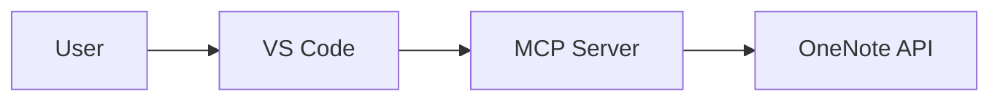
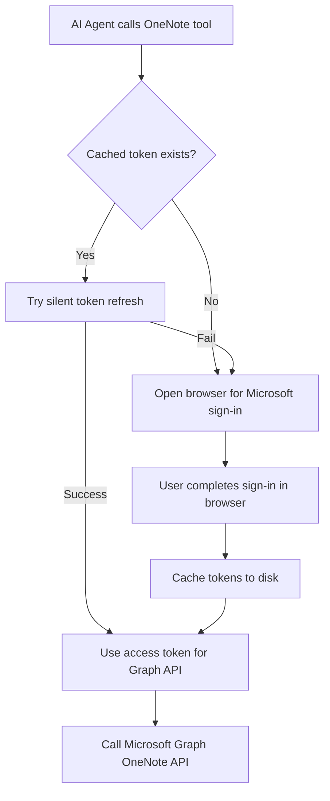

# OneNote MCP Server

A **Model Context Protocol (MCP)** server for Microsoft OneNote, packaged as a VS Code Extension. Enables AI agents (GitHub Copilot, Claude) to read, search, write, and update OneNote pages.

[](vscode:extension/rashmirrout.onenote-mcp)
[](https://github.com/rashmirrout/OneNoteMCP/releases)
[](LICENSE)

## 📚 Documentation

**➡️ [Start Here: Documentation Hub](docs/OneNoteMCP.md)** – Master navigation for all docs

| Document | Description |
|----------|-------------|
| [Documentation Hub](docs/OneNoteMCP.md) | **Start here!** Navigation guide with learning paths |
| [Architecture](docs/architecture.md) | High-level system overview, components, rationale |
| [Design](docs/design.md) | Detailed engineering design, C4 views, flows |
| [Authentication](docs/authentication.md) | PKCE auth, token caching, security |
| [MCP Server](docs/mcp-server.md) | Server process, tool lifecycle, extensibility |
| [API Reference](docs/api-reference.md) | Tool inputs/outputs, contracts, examples |
| [Contributing](docs/contributing.md) | Setup, coding standards, PR checklist |

## 🚀 Quick Install

### Option 1: One-Click Install (Marketplace)

Click the badge above or use this link:

**[➡️ Install OneNote MCP in VS Code](vscode:extension/rashmirrout.onenote-mcp)**

### Option 2: Install from GitHub Release

1. Go to [Releases](https://github.com/rashmirrout/OneNoteMCP/releases)
2. Download the latest `.vsix` file
3. In VS Code, press `Ctrl+Shift+P` → "Extensions: Install from VSIX"
4. Select the downloaded file

### Option 3: Command Line

```bash
# Download the vsix first, then:
code --install-extension onenote-mcp-1.0.0.vsix
```

## ✨ Features

| Tool | Description |
|------|-------------|
| `search_notebooks` | Search for OneNote notebooks by name |
| `get_notebook_sections` | List all sections in a notebook |
| `get_section_pages` | List all pages in a section |
| `read_page` | Read page content (converted to Markdown) |
| `search_onenote` | Global search across all OneNote pages |
| `create_page` | Create a new page with Markdown content |
| `update_page` | Append Markdown content to an existing page |

### 🎨 Mermaid Diagram Support

Create pages with Mermaid diagrams - they're automatically converted to images:

```markdown
# My Architecture


```

## 🔐 Authentication

**Zero Configuration Required!** 

This extension uses Microsoft's public "Graph PowerShell" client ID, so you don't need to:
- Create an Azure App Registration
- Configure any client secrets
- Set up redirect URIs

### How It Works

1. When you first use a OneNote tool, a browser window opens
2. Sign in with your Microsoft account (supports Passkeys/MFA)
3. Your token is securely cached in `.vscode/onenote-mcp-cache.json`
4. Subsequent requests use the cached token automatically

### Token Security

| Platform | Storage Method |
|----------|---------------|
| Windows | DPAPI encryption |
| macOS | Keychain |
| Linux | libsecret (Secret Service) |
| Fallback | Plaintext file (with warning) |

## 🔧 MCP Configuration

This section explains how to configure the OneNote MCP server for use with **GitHub Copilot in VS Code** and **Claude Desktop**.

---

### GitHub Copilot in VS Code

> **Automatic** – no manual configuration needed!

When you install this extension in VS Code, it automatically registers itself as an MCP server via the VS Code MCP provider API. GitHub Copilot (and other VS Code language model clients) will discover the server automatically.

**Steps:**

1. **Install the extension** (see Quick Install above).
2. **Open a workspace/folder** in VS Code.
3. **Use Copilot Chat** – the OneNote tools are available immediately.

**Verify MCP is active:**

1. Open Command Palette: `Ctrl+Shift+P`
2. Run: `MCP: List Servers`
3. You should see **OneNote MCP Server** listed.

**Example prompts:**

```
@workspace Find my notebook called "Work Notes" and list its sections
```

```
@workspace Read the page "Meeting Notes" from my Work notebook
```

```
@workspace Create a new page called "Project Ideas" in my Personal notebook
```

---

### Claude Desktop

Claude Desktop requires a manual configuration entry in its `claude_desktop_config.json` file.

**Step 1: Locate your config file**

| Platform | Path |
|----------|------|
| Windows | `%APPDATA%\Claude\claude_desktop_config.json` |
| macOS | `~/Library/Application Support/Claude/claude_desktop_config.json` |
| Linux | `~/.config/Claude/claude_desktop_config.json` |

**Step 2: Add the MCP server entry**

Open (or create) the file and add the `onenote-mcp` entry under `mcpServers`:

```json
{
  "mcpServers": {
    "onenote-mcp": {
      "command": "node",
      "args": [
        "C:\\path\\to\\OneNoteMCP\\dist\\server.js"
      ],
      "env": {
        "ONENOTE_MCP_CACHE_DIR": "C:\\path\\to\\your\\cache\\folder"
      }
    }
  }
}
```

> **Important:** Replace `C:\\path\\to\\OneNoteMCP\\dist\\server.js` with the actual path to the compiled server. If you installed via VSIX, find your VS Code extensions folder:
> - Windows: `%USERPROFILE%\.vscode\extensions\rashmirrout.onenote-mcp-1.0.0\dist\server.js`
> - macOS/Linux: `~/.vscode/extensions/rashmirrout.onenote-mcp-1.0.0/dist/server.js`

> **Tip:** Set `ONENOTE_MCP_CACHE_DIR` to a folder where token cache will be stored (e.g., `C:\\Users\\YourName\\.onenote-mcp`).

**Step 3: Restart Claude Desktop**

After saving the config, restart Claude Desktop. The OneNote tools will now appear in Claude's available tools.

**Step 4: Authenticate**

On first use, a browser window will open for Microsoft sign-in. Complete the authentication, and tokens will be cached at the path you specified.

---

### Troubleshooting MCP Configuration

| Issue | Solution |
|-------|----------|
| Tools not appearing in Copilot | Ensure extension is installed and a workspace is open. Run `MCP: List Servers` to verify. |
| Tools not appearing in Claude | Check `claude_desktop_config.json` path and restart Claude Desktop. |
| Auth popup doesn't open | Ensure `localhost:3000` is not blocked by firewall. |
| "Port 3000 in use" error | Stop any process using port 3000 and retry. |
| Token cache errors on Linux | Install `libsecret` for secure storage, or accept plaintext fallback. |

---

### VS Code MCP Configuration (Without Installing Extension)

If you want to run the MCP server **locally from source** (without installing the VSIX), you can configure VS Code to use your local build via the workspace or user `mcp.json` file.

**Step 1: Build the server**

```bash
git clone https://github.com/rashmirrout/OneNoteMCP.git
cd OneNoteMCP
npm install
npm run compile
```

**Step 2: Create or edit `.vscode/mcp.json` in your workspace**

Create a file at `.vscode/mcp.json` (or `~/.vscode/mcp.json` for user-level config):

```json
{
  "servers": {
    "onenote-mcp": {
      "type": "stdio",
      "command": "node",
      "args": [
        "C:\\path\\to\\OneNoteMCP\\dist\\server.js"
      ],
      "env": {
        "ONENOTE_MCP_CACHE_DIR": "${workspaceFolder}/.vscode"
      }
    }
  }
}
```

> **Important:** Replace `C:\\path\\to\\OneNoteMCP\\dist\\server.js` with the **absolute path** to your cloned repo's `dist/server.js`.

> **Tip:** Use `${workspaceFolder}/.vscode` for the cache directory to store tokens per project, or use an absolute path like `C:\\Users\\YourName\\.onenote-mcp`.

**Step 3: Reload VS Code**

After saving `mcp.json`, reload VS Code (`Ctrl+Shift+P` → `Developer: Reload Window`).

**Step 4: Verify the server is registered**

1. Open Command Palette: `Ctrl+Shift+P`
2. Run: `MCP: List Servers`
3. You should see **onenote-mcp** listed.

**Step 5: Use with Copilot**

The OneNote tools are now available in GitHub Copilot Chat without installing the extension.

---

### 🔑 Authentication Behavior (When Does the Login Page Appear?)

Understanding when the Microsoft sign-in page opens is important for a smooth experience.

#### When the Login Page Appears Automatically

| Scenario | Login Page Opens? |
|----------|-------------------|
| **First-ever tool call** | ✅ Yes – no cached token exists yet |
| **Token cache deleted** (manual or via Sign Out) | ✅ Yes – must re-authenticate |
| **Refresh token expired** (~90 days of inactivity) | ✅ Yes – silent refresh fails |
| **User revoked app access** in Microsoft account settings | ✅ Yes – token invalid |
| **Different Microsoft account needed** | ✅ Yes – after signing out first |

#### When the Login Page Does NOT Appear

| Scenario | Login Page Opens? |
|----------|-------------------|
| **Valid cached token exists** | ❌ No – uses cached access token |
| **Access token expired but refresh token valid** | ❌ No – silently refreshes in background |
| **Subsequent tool calls after first auth** | ❌ No – reuses cached token |

#### How Authentication Works Step-by-Step



#### Token Lifetimes

| Token Type | Typical Lifetime | What Happens When Expired |
|------------|------------------|---------------------------|
| **Access Token** | ~1 hour | Silently refreshed using refresh token (no popup) |
| **Refresh Token** | ~90 days (rolling) | Login page opens for re-authentication |

#### Where Tokens Are Cached

| Configuration | Cache Location |
|---------------|----------------|
| VS Code Extension (installed) | `<workspace>/.vscode/onenote-mcp-cache.json` or VS Code global storage |
| mcp.json (local build) | Path specified in `ONENOTE_MCP_CACHE_DIR` env variable |
| Claude Desktop | Path specified in `env.ONENOTE_MCP_CACHE_DIR` in config |

#### Forcing Re-Authentication

If you need to sign in with a different account or refresh your session:

**Option 1: VS Code Command (if extension installed)**
1. `Ctrl+Shift+P` → **OneNote MCP: Sign Out**
2. Next tool call will open the login page

**Option 2: Delete Cache File Manually**
1. Delete the cache file at the path shown above
2. Next tool call will open the login page

**Option 3: Revoke Access in Microsoft Account**
1. Go to https://account.microsoft.com/privacy/app-access
2. Find "Graph PowerShell" and remove access
3. Next tool call will require full re-authentication

#### Timeout Behavior

- The login page must be completed within **5 minutes**.
- If you don't complete sign-in within 5 minutes, the tool call fails with a timeout error.
- Simply retry the tool call to get a fresh login page.

---

### Example `mcp.json` Configurations

**Windows (workspace-level):**
```json
{
  "servers": {
    "onenote-mcp": {
      "type": "stdio",
      "command": "node",
      "args": ["C:\\Dev\\OneNoteMCP\\dist\\server.js"],
      "env": {
        "ONENOTE_MCP_CACHE_DIR": "C:\\Users\\YourName\\.onenote-mcp"
      }
    }
  }
}
```

**macOS/Linux (workspace-level):**
```json
{
  "servers": {
    "onenote-mcp": {
      "type": "stdio",
      "command": "node",
      "args": ["/home/user/OneNoteMCP/dist/server.js"],
      "env": {
        "ONENOTE_MCP_CACHE_DIR": "/home/user/.onenote-mcp"
      }
    }
  }
}
```

---

## 📋 Usage Examples

### With GitHub Copilot Chat

```
@workspace Find my notebook called "Work Notes" and list its sections
```

```
@workspace Read the page "Meeting Notes" from my Work notebook
```

```
@workspace Create a new page called "Project Ideas" in my Personal notebook with a bullet list of ideas
```

### With Claude Desktop

Once configured (see above), you can ask Claude directly:

```
Search my OneNote notebooks for "Project Alpha"
```

```
Read the page with ID <page_id> and summarize it
```

```
Create a new page in section <section_id> titled "Weekly Report" with today's notes
```

## 🛠️ Commands

Access these via Command Palette (`Ctrl+Shift+P` / `Cmd+Shift+P`):

| Command | Description |
|---------|-------------|
| `OneNote MCP: Check Auth Status` | Shows if you're signed in and which account is active. Displays ✅ or ⚠️ status with options to sign in/out. |
| `OneNote MCP: Sign In` | Clears any existing session and prepares for re-authentication. Next tool call will open the login page. |
| `OneNote MCP: Sign Out` | Clears cached tokens completely. You'll need to sign in again on next tool use. |

### How to Check If Authentication Succeeded

**Method 1: Use the Status Command**
1. Press `Ctrl+Shift+P`
2. Type: `OneNote MCP: Check Auth Status`
3. You'll see one of:
   - ✅ **Authenticated as user@example.com** – you're signed in
   - ⚠️ **Not signed in** – no valid session

**Method 2: Check the Output Panel**
1. Open Output panel: `Ctrl+Shift+U`
2. Select **OneNote MCP** from the dropdown
3. Look for authentication messages

**Method 3: Check if Cache File Exists**
- If the file `<cache-dir>/onenote-mcp-cache.json` exists and has content, you're authenticated.
- Cache locations:
  - Extension: `<workspace>/.vscode/onenote-mcp-cache.json`
  - mcp.json: Path set in `ONENOTE_MCP_CACHE_DIR`
  - Claude Desktop: Path set in config

### How to Force Re-Authentication

**Method 1: Sign In Command (clears cache and prepares re-auth)**
1. `Ctrl+Shift+P` → `OneNote MCP: Sign In`
2. Use any OneNote tool – login page will open

**Method 2: Sign Out then use a tool**
1. `Ctrl+Shift+P` → `OneNote MCP: Sign Out`
2. Use any OneNote tool – login page will open

**Method 3: Delete cache file manually**
1. Delete `onenote-mcp-cache.json` from your cache directory
2. Use any OneNote tool – login page will open

## 📁 Project Structure

```
onenote-mcp/
├── src/
│   ├── extension.ts          # VS Code extension entry
│   ├── server/
│   │   └── index.ts          # MCP server with 7 tools
│   ├── auth/
│   │   └── msal-client.ts    # MSAL PKCE authentication
│   ├── graph/
│   │   └── onenote-client.ts # Microsoft Graph API client
│   └── utils/
│       └── markdown.ts       # Markdown ↔ HTML conversion
├── dist/                     # Compiled output
├── package.json
└── webpack.config.js
```

## 🏗️ Development

This section provides step-by-step instructions for setting up the development environment, building from source, and testing locally. These instructions are designed for beginners with no prior experience.

---

### Prerequisites

Before you begin, ensure you have the following installed on your computer:

#### 1. Node.js (Version 20 or higher)

Node.js is a JavaScript runtime required to build and run this project.

**Windows Installation:**
1. Visit [https://nodejs.org/](https://nodejs.org/)
2. Download the **LTS** (Long Term Support) version (20.x or higher)
3. Run the installer and follow the prompts (accept all defaults)
4. Restart your computer after installation

**Verify Installation:**
Open a terminal (PowerShell or Command Prompt) and run:
```bash
node --version
```
You should see something like `v20.x.x` or higher.

#### 2. Git

Git is required to download the source code.

**Windows Installation:**
1. Visit [https://git-scm.com/download/win](https://git-scm.com/download/win)
2. Download and run the installer
3. Accept all default options during installation

**Verify Installation:**
```bash
git --version
```
You should see something like `git version 2.x.x`.

#### 3. Visual Studio Code (Version 1.96 or higher)

**Installation:**
1. Visit [https://code.visualstudio.com/](https://code.visualstudio.com/)
2. Download and install VS Code for your operating system
3. Launch VS Code after installation

**Verify Version:**
- In VS Code, click **Help** → **About**
- Ensure the version is 1.96.0 or higher

---

### Step 1: Download the Source Code

Open a terminal and navigate to where you want to store the project, then run:

```bash
# Clone the repository from GitHub
git clone https://github.com/rashmirrout/OneNoteMCP.git

# Navigate into the project folder
cd OneNoteMCP
```

---

### Step 2: Install Dependencies

This project uses npm (Node Package Manager) to manage dependencies. Run the following command to install all required packages:

```bash
npm install
```

**What this does:**
- Downloads all required libraries listed in `package.json`
- Creates a `node_modules` folder containing the dependencies
- May take 1-3 minutes depending on your internet speed

**If you encounter errors:**
- Ensure you're in the `OneNoteMCP` folder
- Try deleting `node_modules` folder and `package-lock.json`, then run `npm install` again

---

### Step 3: Compile the Project

Compile the TypeScript source code into JavaScript:

```bash
npm run compile
```

**What this does:**
- Runs webpack to bundle the TypeScript files
- Creates the `dist/` folder with compiled JavaScript files
- You should see output indicating successful compilation

**Expected output:**
```
webpack 5.x.x compiled successfully in XXXXms
```

---

### Step 4: Package as VSIX (Optional)

To create an installable VS Code extension file (.vsix):

```bash
npx @vscode/vsce package
```

**What this does:**
- Creates a file named `onenote-mcp.vsix` in the project root
- This file can be shared and installed in any VS Code instance

**Note:** You may be prompted about the README or LICENSE. Press Enter to continue with defaults.

---

### Development Mode (Watch Mode)

During development, you can use watch mode to automatically recompile when you make changes:

```bash
npm run watch
```

**What this does:**
- Starts webpack in watch mode
- Automatically recompiles whenever you save a file
- Leave this running in the terminal while developing

**To stop watch mode:** Press `Ctrl+C` in the terminal.

---

### Testing the Extension Locally

Follow these steps to test your changes in a real VS Code environment:

#### Method 1: Using F5 (Recommended for Development)

1. **Open the project in VS Code:**
   - Open VS Code
   - Click **File** → **Open Folder**
   - Select the `OneNoteMCP` folder

2. **Ensure the code is compiled:**
   - Open the terminal in VS Code: **Terminal** → **New Terminal**
   - Run `npm run compile` or start `npm run watch`

3. **Launch the Extension Development Host:**
   - Press `F5` on your keyboard
   - OR click **Run** → **Start Debugging**
   
   **What happens:**
   - A new VS Code window opens (called "Extension Development Host")
   - Your extension is automatically loaded in this window
   - The original window shows debug output

4. **Test the extension:**
   - In the new window, open the Command Palette: `Ctrl+Shift+P`
   - Type "OneNote" to see available commands
   - Test the MCP tools through GitHub Copilot or your AI assistant

5. **Make changes and reload:**
   - Modify the source code in the original window
   - If using watch mode, it auto-compiles
   - Press `Ctrl+Shift+F5` to reload the extension
   - OR close and re-open with `F5`

#### Method 2: Install VSIX Manually

1. **Build the VSIX package:**
   ```bash
   npx @vscode/vsce package
   ```

2. **Install in VS Code:**
   - Open VS Code
   - Press `Ctrl+Shift+X` to open Extensions panel
   - Click the `...` menu at the top
   - Select **Install from VSIX...**
   - Browse to and select `onenote-mcp.vsix`

3. **Reload VS Code:**
   - Press `Ctrl+Shift+P`
   - Type "Reload Window" and select it

---

### Troubleshooting Common Issues

#### "npm: command not found"
- Node.js is not installed or not in your PATH
- Restart your terminal after installing Node.js
- On Windows, restart your computer

#### "Cannot find module" errors during compile
- Run `npm install` again
- Delete `node_modules` folder and `package-lock.json`, then run `npm install`

#### Extension not appearing in F5 window
- Check the Debug Console in VS Code for errors
- Ensure `npm run compile` completed successfully
- Check that `dist/` folder contains `extension.js` and `server.js`

#### Authentication popup doesn't appear
- Check your firewall isn't blocking localhost:3000
- Ensure you have an internet connection
- Try signing out and signing in again

#### "msal-node-extensions" native module errors
- Run `npm rebuild` in the project folder
- On Windows, you may need to install Windows Build Tools:
  ```bash
  npm install --global windows-build-tools
  ```

---

### Project Scripts Reference

| Command | Description |
|---------|-------------|
| `npm run compile` | Compile the project once |
| `npm run watch` | Compile and watch for changes |
| `npm run lint` | Run ESLint to check code quality |
| `npm test` | Run the test suite |
| `npx @vscode/vsce package` | Create installable VSIX file |

---

### Folder Structure After Build

```
OneNoteMCP/
├── dist/                    # Compiled JavaScript output
│   ├── extension.js         # VS Code extension entry point
│   └── server.js            # MCP server bundle
├── node_modules/            # Installed dependencies
├── src/                     # Source TypeScript files
├── onenote-mcp.vsix         # Packaged extension (after packaging)
├── package.json             # Project configuration
└── webpack.config.js        # Build configuration
```

## 📄 API Permissions

The extension requests the following Microsoft Graph permissions:

| Permission | Purpose |
|------------|---------|
| `Notes.Read` | Read notebooks, sections, and pages |
| `Notes.ReadWrite` | Create and update pages |
| `offline_access` | Refresh tokens automatically |
| `openid` | OpenID Connect authentication |
| `profile` | User profile information |

## 🤝 Contributing

Contributions are welcome! Please feel free to submit a Pull Request.

## 📝 License

This project is licensed under the MIT License - see the [LICENSE](LICENSE) file for details.

## 🙏 Acknowledgments

- [Model Context Protocol SDK](https://github.com/modelcontextprotocol/sdk)
- [Microsoft Graph API](https://docs.microsoft.com/graph/)
- [MSAL Node](https://github.com/AzureAD/microsoft-authentication-library-for-js)
# one_note_mcp
