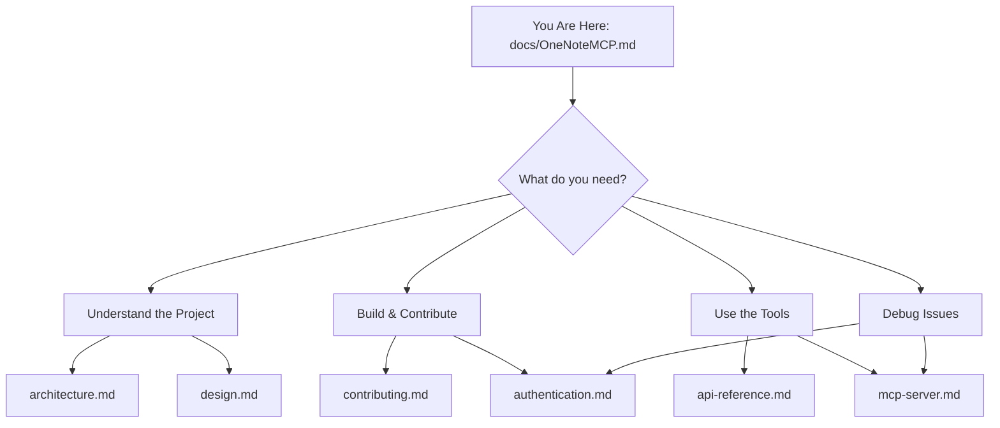

# OneNote MCP – Documentation Hub

> Start here! This is the master navigation document for all project documentation.

---

## 📖 Documentation Map

---

## 🗂️ Document Index

| Document | Purpose | Best For |
|----------|---------|----------|
| [architecture.md](./architecture.md) | High-level system overview, components, rationale | Understanding how everything fits together |
| [design.md](./design.md) | Detailed engineering design, C4 views, flows | Deep-diving into implementation details |
| [authentication.md](./authentication.md) | PKCE auth, token caching, security | Understanding sign-in, troubleshooting auth |
| [mcp-server.md](./mcp-server.md) | MCP server process, tool lifecycle | Understanding how tools work internally |
| [api-reference.md](./api-reference.md) | Tool inputs/outputs, contracts, examples | Quick reference when using or extending tools |
| [contributing.md](./contributing.md) | Setup, coding standards, PR checklist | Getting started as a contributor |

---

## 🚀 Quick Start Paths

### "I want to understand what this project does"

1. **Start with** → [architecture.md](./architecture.md) – What it is, why it's unique, high-level components
2. **Then read** → [design.md](./design.md) – Detailed flows, design choices, extensibility

### "I want to contribute code"

1. **Start with** → [contributing.md](./contributing.md) – Setup, build, test, PR process
2. **Reference** → [architecture.md](./architecture.md) – Understand the structure
3. **Deep-dive** → [mcp-server.md](./mcp-server.md) – If adding/modifying tools
4. **Deep-dive** → [authentication.md](./authentication.md) – If touching auth

### "I want to use the OneNote tools"

1. **Start with** → [api-reference.md](./api-reference.md) – All 7 tools, inputs, outputs, examples
2. **Troubleshoot** → [authentication.md](./authentication.md) – If auth issues arise

### "I'm debugging an issue"

1. **Auth problems?** → [authentication.md](./authentication.md) – Token flow, cache locations, re-auth steps
2. **Tool errors?** → [mcp-server.md](./mcp-server.md) – Rate limits, error handling
3. **Build issues?** → [contributing.md](./contributing.md) – Prerequisites, troubleshooting

---

## 📚 Document Summaries

### [architecture.md](./architecture.md)
**Audience:** Everyone (especially newcomers)

Covers:
- What the project solves and why it's unique
- High-level architecture diagram
- Component responsibilities (extension, server, auth, Graph client, Markdown adapter)
- Runtime data flows with Mermaid diagrams
- Design choices and rationale
- Security considerations
- Future improvements

### [design.md](./design.md)
**Audience:** Engineers implementing features

Covers:
- Goals and scope
- User/agent personas
- C4 system context and container views
- Detailed component specifications
- Sequence diagrams for auth, tool execution, rate limiting
- Data structures and error handling patterns
- Extensibility guide

### [authentication.md](./authentication.md)
**Audience:** Anyone dealing with sign-in or tokens

Covers:
- OAuth2 + PKCE flow explanation
- Token lifetimes (access ~1hr, refresh ~90 days)
- Cache locations per configuration method
- When login page appears/doesn't appear
- VS Code commands (Check Status, Sign In, Sign Out)
- Forcing re-authentication (4 methods)
- Security considerations

### [mcp-server.md](./mcp-server.md)
**Audience:** Engineers adding/modifying tools

Covers:
- Server architecture (stdio, McpServer, zod)
- All 7 tools with inputs/outputs
- Request lifecycle diagram
- Rate-limit handling with retry logic
- Markdown/HTML conversion pipeline
- Step-by-step guide for adding new tools
- Testing tips

### [api-reference.md](./api-reference.md)
**Audience:** Tool users and integrators

Covers:
- Transport and host configuration
- Auth requirements and status checking
- Common response shapes (success, error, rate-limit)
- Complete tool catalog with schemas
- Usage examples (pseudocode)
- Operational notes

### [contributing.md](./contributing.md)
**Audience:** New contributors

Covers:
- Prerequisites (Node.js, Git, VS Code)
- One-time setup steps
- Daily dev loop (watch + F5)
- Branch/commit hygiene
- Coding standards
- Testing & verification
- PR checklist
- Release process (maintainers)

---

## 🔗 External References

- [README.md](../README.md) – Main project README with install instructions
- [Model Context Protocol SDK](https://github.com/modelcontextprotocol/sdk)
- [Microsoft Graph OneNote API](https://learn.microsoft.com/graph/onenote-concept-overview)
- [MSAL Node](https://github.com/AzureAD/microsoft-authentication-library-for-js)
- [VS Code MCP Provider API](https://code.visualstudio.com/api/references/vscode-api#language-model)

---

## 🆘 Still Lost?

1. **Check the main [README.md](../README.md)** for install and quick usage
2. **Open an issue** on GitHub with your question
3. **Search existing issues** – someone may have asked before

---

*Last updated: December 2025*
