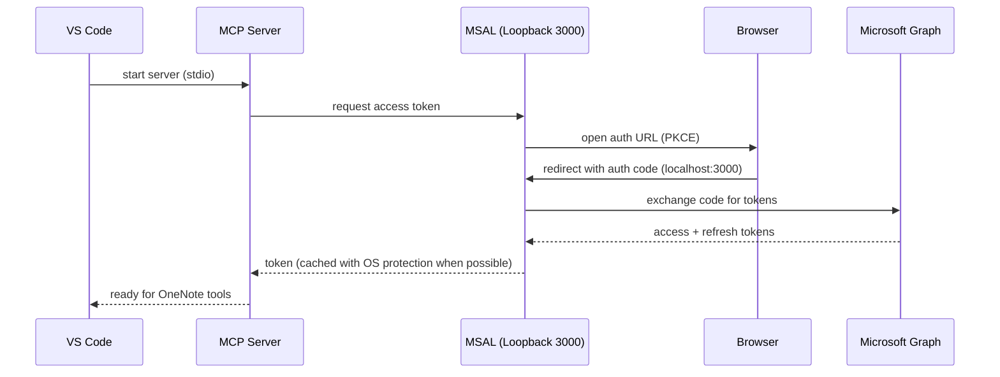
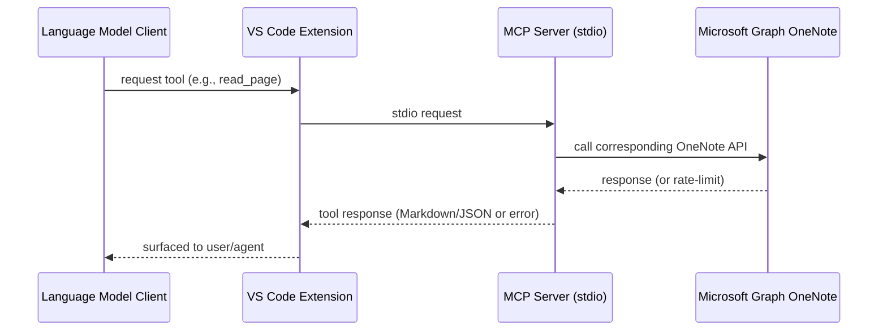
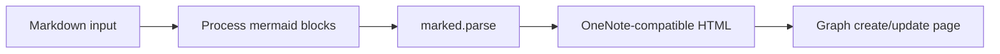

# OneNote MCP – Architecture & Design Overview

> Teaching-first guide for contributors. Explains what the project solves, why it is unique, how it is built, and how to extend it. Includes flows and diagrams.

---

## 1. Project Overview
- **What it is**: A Model Context Protocol (MCP) server packaged as a VS Code extension that lets AI agents (e.g., GitHub Copilot / Claude) read, search, and write Microsoft OneNote content via Microsoft Graph.
- **Problem it solves**: Brings structured access to OneNote into AI workflows so assistants can reason over notebooks, sections, and pages, and create/update notes with proper context and formatting.
- **Why unique**:
  - Runs as a VS Code extension with zero manual Azure app setup (uses Microsoft’s public client ID for OneNote/Graph).
  - Provides secure token caching with native encryption (DPAPI/Keychain/libsecret fallback to plaintext with warning).
  - Implements backoff-aware Graph calls and rate-limit surfaced errors for agents.
  - Converts Markdown ↔ HTML with Mermaid rendering to OneNote-compatible HTML.
  - Ships MCP tooling definitions so AI agents can directly call OneNote operations (search, read, create, update).

---

## 2. High-Level Architecture
- **VS Code extension host**: Loads the MCP server and exposes MCP server definition to language model clients via `vscode.lm.registerMcpServerDefinitionProvider`.
- **MCP server (stdio transport)**: Runs a Node process (bundled to `dist/server.js`) that exposes tools for OneNote operations over stdio.
- **Auth layer (MSAL with PKCE)**: Uses Microsoft public client ID with loopback redirect on `http://localhost:3000`; caches tokens with native OS protection when available.
- **Graph client wrapper**: Thin client around Microsoft Graph OneNote endpoints with exponential backoff and rate-limit detection.
- **Markdown/HTML adapter**: Converts Markdown (including ```mermaid blocks) to OneNote-compatible HTML; converts HTML back to Markdown for readable responses.
- **Cache storage**: Token cache stored under workspace `.vscode/onenote-mcp-cache.json` (or global storage if no workspace).

```mermaid
flowchart TD
  VSCode[VS Code Extension Host] -->|register provider| MCPProvider[MCP Server Definition Provider]
  MCPProvider -->|spawns| MCPServer[Node MCP Server (stdio)]
  MCPServer -->|auth| MSAL[MSAL PKCE]
  MSAL -->|tokens| GraphClient[OneNote Graph Client]
  MCPServer -->|tools| GraphClient
  MCPServer -->|convert| MarkdownHTML[Markdown ↔ HTML Adapter]
  GraphClient --> OneNoteAPI[Microsoft Graph OneNote]
```

---

## 3. Components and Responsibilities

### 3.1 VS Code Extension (`src/extension.ts`)
- Registers MCP server definition provider (`onenoteMcp`) so LMs can discover/connect.
- Resolves cache directory per workspace or global storage; handles multi-root prompt.
- Exposes three commands:
  - `OneNote MCP: Check Auth Status` – reads cache file, shows ✅/⚠️ with account email, offers quick actions
  - `OneNote MCP: Sign In` – clears existing cache to force re-authentication on next tool call
  - `OneNote MCP: Sign Out` – clears token cache completely
- Launches stdio server via `node dist/server.js` and passes `ONENOTE_MCP_CACHE_DIR` env.

### 3.2 MCP Server (`src/server/index.ts`)
- Uses `@modelcontextprotocol/sdk` with `StdioServerTransport`.
- Tools implemented:
  1. `search_notebooks` – fuzzy search notebook names.
  2. `get_notebook_sections` – list sections for a notebook.
  3. `get_section_pages` – list pages for a section.
  4. `read_page` – fetch HTML, convert to Markdown.
  5. `search_onenote` – Graph search across pages.
  6. `create_page` – Markdown → HTML, create page.
  7. `update_page` – Markdown → HTML, append to page.
- Handles rate-limit responses explicitly and returns structured error payloads to agents.

### 3.3 Auth (`src/auth/msal-client.ts`)
- Public client ID `14d82eec-204b-4c2f-b7e8-296a70dab67e`; scopes include Notes.Read/Notes.ReadWrite/offline_access/openid/profile.
- Loopback server on port 3000 for PKCE auth; 5-minute timeout; friendly success/error pages.
- Token cache: tries `@azure/msal-node-extensions` for OS-protected storage; falls back to plaintext with warning.

### 3.4 Graph Client (`src/graph/onenote-client.ts`)
- Wraps Microsoft Graph OneNote endpoints with exponential backoff (1s/2s/4s) and max 3 retries.
- Detects 429/5xx and returns `RateLimitError` with retry-after guidance.
- Provides helpers: list/search notebooks, get sections, get pages, read page content, search pages, create page, append to page.

### 3.5 Markdown/HTML Adapter (`src/utils/markdown.ts`)
- Converts Markdown to HTML using `marked`.
- Transforms ```mermaid blocks into mermaid.ink image URLs via pako compression for OneNote rendering.
- Provides basic HTML → Markdown conversion for readable agent responses.

### 3.6 Build & Packaging
- Dual webpack configs: `extension.ts` → `dist/extension.js`, `server/index.ts` → `dist/server.js`.
- Externals: `vscode`, `@azure/msal-node-extensions`, `keytar` kept external to allow native loading.
- VSIX packaging via `npx @vscode/vsce package`.

---

## 4. Runtime Data Flows (Mermaid)

### 4.1 Auth & Token Flow


### 4.2 Tool Invocation Flow


### 4.3 Markdown → OneNote HTML Conversion


---

## 5. Design Choices & Rationale
- **Stdio transport for MCP**: Simplifies integration with VS Code MCP provider and keeps isolation from extension host.
- **Public client ID**: Removes need for users to create Azure AD apps; leverages Microsoft’s multi-tenant public client for OneNote.
- **Loopback redirect (localhost:3000)**: Easiest cross-platform auth for public clients; MSAL PKCE-compatible.
- **Token cache in workspace .vscode**: Ensures per-project isolation; falls back to global storage when no workspace; respects multi-root with folder picker.
- **OS-protected cache first**: Uses `@azure/msal-node-extensions` (DPAPI/Keychain/libsecret); plaintext fallback with explicit warning.
- **Exponential backoff**: Reduces throttling risk and surfaces retry guidance to agents.
- **Markdown-first UX**: Agents and users can author in Markdown; adapter handles HTML conversion and mermaid rendering.
- **Mermaid via mermaid.ink**: Avoids client-side Mermaid runtime; produces static image URLs compatible with OneNote.
- **Webpack bundling with externals**: Keeps native deps external to avoid bundling native binaries; smaller bundles and predictable runtime.

---

## 6. Extensibility Guide (How to Add Things)
- **Add a new MCP tool**:
  1) Define zod schema for params.
  2) Implement handler using `OneNoteClient` or new Graph call.
  3) Handle rate-limit via `isRateLimitError` check and return JSON errors.
  4) Add to `server/index.ts` and rebuild.
- **Add new Graph endpoint support**:
  - Extend `OneNoteClient` with a new method using `executeWithRetry`.
  - Prefer `select()` to limit fields; return typed objects.
- **Change auth scopes**:
  - Update `SCOPES` in `src/auth/msal-client.ts`; ensure least privilege.
- **Support different cache location**:
  - Adjust `getCacheDirectory` in `src/extension.ts` and env passed to MCP server.
- **Improve HTML→Markdown fidelity**:
  - Replace simple converter with `turndown` if richer fidelity is needed.
- **Add telemetry or logging**:
  - Insert structured logging in MCP server handlers; keep PII out of logs.

---

## 7. Security & Privacy Considerations
- Tokens cached on disk; best-effort native encryption. Plaintext fallback is warned.
- No tokens are sent to third-party services besides Microsoft Graph.
- Loopback server only binds to `localhost:3000` and shuts down after auth.
- No persistence of OneNote content beyond Graph responses; all transient in memory.

---

## 8. Reliability & Error Handling
- Exponential backoff on 429/5xx with rate-limit payloads to agents.
- `RateLimitError` surfaced with `retryAfterSeconds` when available.
- Clear user-facing error messages in MCP tool responses.
- Watch mode recommended during dev to catch build errors early.

---

## 9. Performance Notes
- Graph queries are bounded (e.g., `.top(25)` on search) to reduce payloads.
- Markdown → HTML conversion is synchronous; heavy pages may benefit from streaming in future.
- Bundles kept small by externalizing native modules.

---

## 10. Future Improvements
- Full HTML → Markdown fidelity via `turndown` or similar.
- Richer search (filters by section/notebook; semantic search with embeddings).
- Caching of notebook/section metadata to reduce repeated Graph calls.
- Telemetry (opt-in) for tool success/latency to guide improvements.
- Better offline handling with queued writes.
- Configurable auth redirect port (fallback if 3000 is occupied).
- Unit/integration tests for Graph client with mocked responses.

---

## 11. Contributor Quickstart (TL;DR)
- Install Node 20+, Git, VS Code 1.96+.
- `git clone https://github.com/rashmirrout/OneNoteMCP.git && cd OneNoteMCP`
- `npm install`
- `npm run watch` (in one terminal)
- Press `F5` in VS Code to launch Extension Development Host.
- Use Command Palette → search OneNote commands and test MCP tools.

---

## 12. Reference Links
- Model Context Protocol SDK: https://github.com/modelcontextprotocol/sdk
- Microsoft Graph OneNote API: https://learn.microsoft.com/graph/onenote-concept-overview
- MSAL Node: https://github.com/AzureAD/microsoft-authentication-library-for-js
- VS Code MCP Provider API: https://code.visualstudio.com/api/references/vscode-api#language-model
