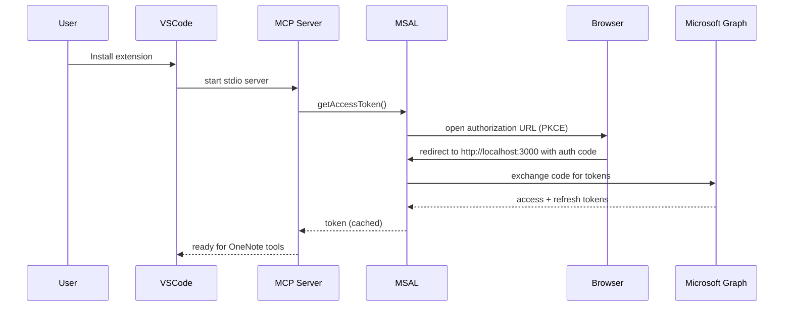

# OneNote MCP – Authentication & Token Handling

> Deep-dive on how sign-in, token caching, and security work. Teaching style; assumes no prior auth knowledge.

---

## 1. Objectives
- Provide seamless sign-in with Microsoft accounts using OAuth2 + PKCE.
- Avoid per-user Azure app setup by using Microsoft’s public client ID.
- Store tokens securely when possible; warn when plaintext fallback is used.
- Surface clear errors and timeouts; be resilient to port conflicts and rate limits.

---

## 2. Key Facts
- **Client ID**: `14d82eec-204b-4c2f-b7e8-296a70dab67e` (Microsoft public client for OneNote/Graph).
- **Authority**: `https://login.microsoftonline.com/common` (multi-tenant).
- **Redirect URI**: `http://localhost:3000` (loopback, PKCE-compatible).
- **Scopes**:
  - `https://graph.microsoft.com/Notes.Read`
  - `https://graph.microsoft.com/Notes.ReadWrite`
  - `offline_access` (refresh tokens)
  - `openid`, `profile` (basic identity)

---

## 3. End-to-End Auth Flow

---

## 4. Token Caching & Storage
- Cache file path: `<workspace>/.vscode/onenote-mcp-cache.json` (or global storage if no workspace).
- Primary approach: `@azure/msal-node-extensions` for OS-protected storage:
  - Windows: DPAPI
  - macOS: Keychain
  - Linux: libsecret (requires `libsecret` package)
- Fallback: plaintext file cache with explicit warning to user (printed to output channel/stdout).

### Cache Plugin Behavior
- Before cache access: reads cache file if present; ignores missing file.
- After cache access: writes serialized cache when changed.
- Secure cache attempts encryption; plaintext writes plain JSON.

---

## 5. Error & Timeout Handling
- 5-minute timeout for the user to complete browser auth; returns a clear timeout error.
- Port conflict on 3000: surfaces an error to the user; they must free the port and retry.
- Friendly HTML pages served on success/failure to guide non-technical users.

---

## 6. Refresh & Silent Acquisition
- On subsequent tool calls, the server first attempts `acquireTokenSilent` using cached account and refresh token.
- If silent acquisition fails with `InteractionRequiredAuthError`, it falls back to interactive loopback flow.

---

## 7. Security Considerations
- Loopback server binds only to `localhost` and shuts down after auth completes or times out.
- Tokens never leave the local machine except to call Microsoft Graph.
- No telemetry is collected.
- Plaintext cache warning prompts users to improve security (e.g., install libsecret on Linux).

---

## 8. Checking Authentication Status

There are multiple ways to verify if authentication succeeded:

### Method 1: VS Code Command (Recommended)
1. Press `Ctrl+Shift+P` (or `Cmd+Shift+P` on macOS)
2. Type: `OneNote MCP: Check Auth Status`
3. You'll see one of:
   - ✅ **Authenticated as user@example.com** – signed in successfully
   - ⚠️ **Not signed in** – no valid session

### Method 2: Check the Output Panel
1. Open Output panel: `Ctrl+Shift+U`
2. Select **OneNote MCP** from the dropdown
3. Look for authentication log messages

### Method 3: Check Cache File
- If the file `<cache-dir>/onenote-mcp-cache.json` exists with content, you're authenticated.
- Cache locations:
  - Extension: `<workspace>/.vscode/onenote-mcp-cache.json`
  - mcp.json: Path set in `ONENOTE_MCP_CACHE_DIR`
  - Claude Desktop: Path set in config `env.ONENOTE_MCP_CACHE_DIR`

---

## 9. Forcing Re-Authentication

Use these methods when you need to sign in with a different account or refresh your session:

### Method 1: Sign In Command (clears cache and prepares re-auth)
1. `Ctrl+Shift+P` → `OneNote MCP: Sign In`
2. Use any OneNote tool – login page will open

### Method 2: Sign Out then use a tool
1. `Ctrl+Shift+P` → `OneNote MCP: Sign Out`
2. Use any OneNote tool – login page will open

### Method 3: Delete cache file manually
1. Delete `onenote-mcp-cache.json` from your cache directory
2. Use any OneNote tool – login page will open

### Method 4: Revoke access in Microsoft Account
1. Go to https://account.microsoft.com/privacy/app-access
2. Find "Graph PowerShell" and remove access
3. Next tool call will require full re-authentication

---

## 10. VS Code Commands Reference

| Command | Description |
|---------|-------------|
| `OneNote MCP: Check Auth Status` | Shows ✅ or ⚠️ status with current account info |
| `OneNote MCP: Sign In` | Clears existing session and prepares for re-auth |
| `OneNote MCP: Sign Out` | Clears cached tokens completely |

---

## 11. Operational Tips
- If the browser does not open, copy the auth URL printed in the console and paste it manually.
- If you see `Port 3000 is already in use`, stop the conflicting process or change the port and rebuild (future improvement).
- To sign out, use the VS Code command: **OneNote MCP: Sign Out**; this deletes the cache file and notifies the provider to reconnect.

---

## 12. Future Improvements
- Configurable redirect port with automatic fallback scanning.
- Device code flow fallback for headless environments.
- Encrypted storage mandate (fail closed) in enterprise mode.
- Telemetry (opt-in) on auth failures to improve UX.
