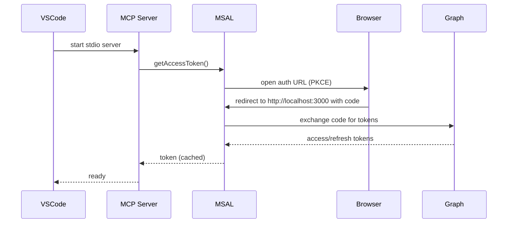
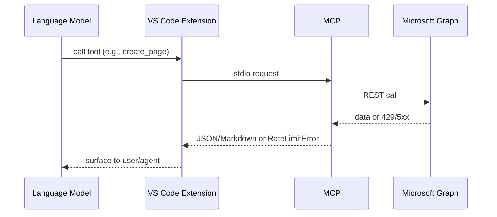
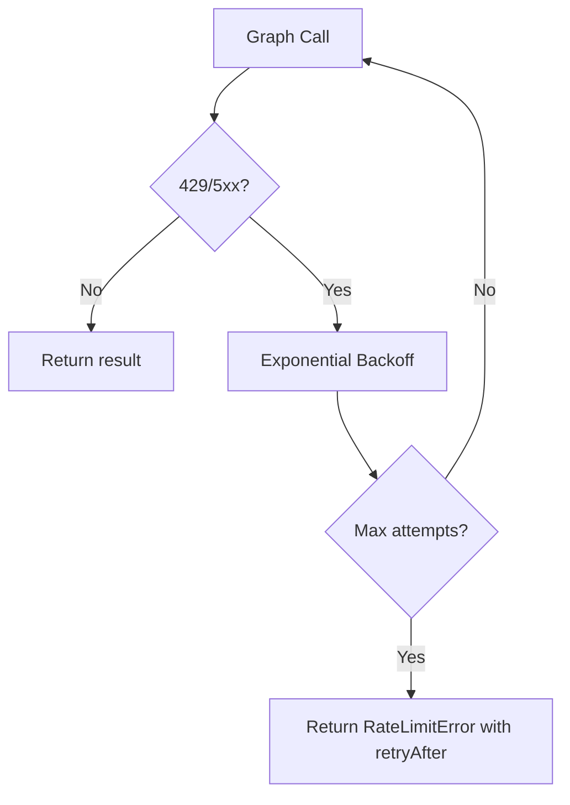

# OneNote MCP – Engineering Design & Flows

> A teaching-style design spec to help contributors understand the system end-to-end, including detailed flows and rationale.

---

## 1) Goals & Scope
- Provide an MCP server that lets AI agents read/search/write OneNote content through Microsoft Graph.
- Deliver as a VS Code extension with minimal setup (no custom Azure app required).
- Be safe by default: secure token caching when possible; explicit warnings otherwise.
- Make agent outputs readable: Markdown-first with reliable conversion to OneNote HTML (incl. Mermaid diagrams).
- Handle rate limits gracefully and surface actionable guidance.

---

## 2) User & Agent Personas
- **Developer/Contributor**: Builds or extends the MCP server, adds tools, debugs Graph calls.
- **AI Agent (Copilot/Claude)**: Calls MCP tools to list/search/read/write OneNote content.
- **End User (non-engineer)**: Installs the extension; authenticates with Microsoft account; expects reliable OneNote access via AI.

---

## 3) System Context (C4 Level 1)
```mermaid
flowchart LR
  User[VS Code User] --> VSCode[VS Code + Extension]
  VSCode --> MCPServer[MCP Server (stdio)]
  MCPServer --> Graph[Microsoft Graph OneNote]
  Graph --> OneNoteData[OneNote Notebooks/Sections/Pages]
```

- The extension hosts the MCP provider and launches the stdio server process.
- The server talks to Microsoft Graph, returning structured results and Markdown content to the agent.

---

## 4) Container View (C4 Level 2)
```mermaid
flowchart TD
  subgraph VSCodeHost[VS Code Host]
    Ext[Extension (TS)]
    Provider[MCP Server Definition Provider]
  end
  subgraph ServerProc[MCP Server Process]
    MCP[server/index.ts]
    Auth[auth/msal-client.ts]
    GraphClient[graph/onenote-client.ts]
    Md[utils/markdown.ts]
  end

  Ext --> Provider
  Provider -->|spawns| MCP
  MCP --> Auth
  MCP --> GraphClient
  MCP --> Md
  GraphClient --> GraphAPI[Microsoft Graph OneNote]
```

---

## 5) Component Details

### 5.1 Extension Host (src/extension.ts)
- Registers MCP server definition provider (`onenoteMcp`).
- Resolves cache directory per workspace or global; prompts on multi-root.
- Provides three commands:
  - `OneNote MCP: Check Auth Status` – reads cache, shows ✅/⚠️ with account info
  - `OneNote MCP: Sign In` – clears cache and triggers re-auth on next tool call
  - `OneNote MCP: Sign Out` – clears cache completely
- Spawns stdio server: `node dist/server.js` with `ONENOTE_MCP_CACHE_DIR` env.

### 5.2 MCP Server (src/server/index.ts)
- Uses `McpServer` + `StdioServerTransport`.
- Zod schemas validate tool inputs.
- Seven tools: search_notebooks, get_notebook_sections, get_section_pages, read_page, search_onenote, create_page, update_page.
- Rate-limit detection returns structured JSON error with retry hints.

### 5.3 Auth (src/auth/msal-client.ts)
- MSAL PKCE with loopback redirect `http://localhost:3000`.
- Public client ID avoids user Azure setup.
- Token cache: OS-protected via `@azure/msal-node-extensions` when available; plaintext fallback with warning.
- 5-minute timeout on auth; friendly HTML success/error pages.

### 5.4 Graph Client (src/graph/onenote-client.ts)
- Exponential backoff (1s/2s/4s, 3 attempts) on 429/5xx.
- Methods: list/search notebooks, get sections, get pages, read page content, search pages, create page, append content.
- Returns `RateLimitError` objects when retries exhausted.

### 5.5 Markdown/HTML Adapter (src/utils/markdown.ts)
- Markdown → HTML via `marked`.
- Mermaid blocks converted to `mermaid.ink` images using `pako` compression.
- Basic HTML → Markdown converter for readable responses.

### 5.6 Build & Packaging
- Webpack bundles extension and server separately to `dist/`.
- Externals: `vscode`, `@azure/msal-node-extensions`, `keytar`.
- VSIX packaging with `npx @vscode/vsce package`.

---

## 6) Detailed Flows

### 6.1 Authentication Flow (PKCE Loopback)


### 6.2 Tool Execution Flow


### 6.3 Markdown to OneNote Page Creation
```mermaid
flowchart LR
  MD[Markdown + ```mermaid blocks] --> Preprocess[Process mermaid blocks]
  Preprocess --> Marked[marked.parse]
  Marked --> HTML[OneNote-compatible HTML]
  HTML --> GraphPost[POST /sections/{id}/pages]
  GraphPost --> Page[New OneNote Page]
```

### 6.4 Rate-Limit Handling


---

## 7) Design Choices (Why)
- **Stdio MCP**: Simplest, robust transport for VS Code host; isolates server process.
- **Public client ID**: Eliminates Azure app registration friction for users.
- **Loopback redirect**: Works cross-platform; avoids custom URI schemes.
- **OS-protected cache first**: Best security posture; transparent fallback with warning.
- **Exponential backoff**: Respect Graph throttling guidance; avoids hammering API.
- **Markdown-first**: Aligns with agent-friendly authoring; minimizes HTML authoring pain.
- **Mermaid via mermaid.ink**: Static image rendering—no client-side Mermaid runtime.
- **Zod validation**: Fail fast on bad inputs; clearer errors to agents.

---

## 8) Key Data Structures
- **RateLimitError**: `{ isRateLimited: true, retryAfterSeconds?, message }`
- **Notebook/Section/Page/SearchResult**: Typed interfaces in `onenote-client.ts`.
- **Tool responses**: JSON (stringified) or Markdown strings back to agents.

---

## 9) Error Handling & Resilience
- Backoff on 429/5xx; return structured rate-limit payloads.
- Friendly auth error pages; timeout after 5 minutes.
- Tool handlers catch and stringify errors for agent consumption.

---

## 10) Security & Privacy
- Token cache stored under workspace `.vscode/onenote-mcp-cache.json` or global storage.
- Native encryption when available; plaintext fallback warning.
- Loopback server only on localhost; no external callbacks.
- No telemetry; no data sent beyond Microsoft Graph.

---

## 11) Extensibility Patterns
- **Add a tool**: Define zod schema → implement handler → call `OneNoteClient` → handle rate-limit → build.
- **Add Graph operation**: Use `executeWithRetry`; limit fields with `select()`; return typed result.
- **Improve conversions**: Swap in `turndown` for richer HTML→MD; adjust mermaid theming.
- **Alternate auth**: Add device code flow fallback if loopback port conflicts are common.

---

## 12) Future Improvements
- Higher-fidelity HTML→Markdown via `turndown`.
- Caching notebook/section metadata; ETag-based conditional requests.
- Semantic search with embeddings + vector store.
- Configurable redirect port / automatic fallback if 3000 is busy.
- More tools: move pages, copy sections, attach files.
- Integration tests with mocked Graph.

---

## 13) Quickstart for Contributors
1. Install Node 20+, Git, VS Code 1.96+.
2. `git clone https://github.com/rashmirrout/OneNoteMCP.git && cd OneNoteMCP`
3. `npm install`
4. `npm run watch` in one terminal.
5. Press `F5` in VS Code to launch Extension Development Host.
6. Use Command Palette and test OneNote tools.

---

## 14) References
- MCP SDK: https://github.com/modelcontextprotocol/sdk
- Graph OneNote API: https://learn.microsoft.com/graph/onenote-concept-overview
- MSAL Node: https://github.com/AzureAD/microsoft-authentication-library-for-js
- VS Code API (MCP provider): https://code.visualstudio.com/api/references/vscode-api#language-model
