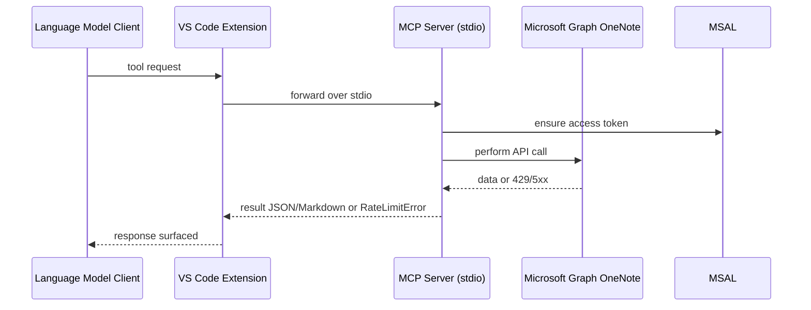

# OneNote MCP – Server & Tool Design

> Deep dive into the MCP server process, its tools, contracts, and how to extend it.

---

## 1. Server Overview
- Runs as a Node stdio process (`dist/server.js`) launched by the VS Code extension.
- Uses `@modelcontextprotocol/sdk` with `StdioServerTransport`.
- Exposes tools that map directly to Microsoft Graph OneNote operations.
- Converts data to agent-friendly Markdown/JSON and handles rate limits explicitly.

---

## 2. Tool Catalog
Each tool uses zod schemas for parameter validation.

1) **search_notebooks**
   - **Purpose**: Fuzzy search notebook names.
   - **Input**: `query` (string)
   - **Output**: JSON array of `{ id, name, isDefault, lastModified }`

2) **get_notebook_sections**
   - **Purpose**: List sections in a notebook.
   - **Input**: `notebook_id` (string)
   - **Output**: JSON array of `{ id, name, lastModified }`

3) **get_section_pages**
   - **Purpose**: List pages in a section.
   - **Input**: `section_id` (string)
   - **Output**: JSON array of `{ id, title, lastModified }`

4) **read_page**
   - **Purpose**: Read a page and return Markdown.
   - **Input**: `page_id` (string)
   - **Output**: Markdown string of the page content.

5) **search_onenote**
   - **Purpose**: Search pages by text.
   - **Input**: `query` (string), `scope` (optional notebook/section ID)
   - **Output**: JSON array of `{ id, title, preview }`

6) **create_page**
   - **Purpose**: Create a page from Markdown.
   - **Input**: `section_id` (string), `title` (string), `content_markdown` (string)
   - **Output**: JSON with `{ success, message, pageId, createdAt }`

7) **update_page**
   - **Purpose**: Append Markdown to an existing page.
   - **Input**: `page_id` (string), `content_markdown` (string)
   - **Output**: JSON with `{ success, message, pageId }`

---

## 3. Internal Flow (Request Lifecycle)


---

## 4. Rate Limit Handling
- Retries up to 3 times with exponential backoff (1s, 2s, 4s) on 429/5xx.
- If exhausted, returns `{ isRateLimited: true, retryAfterSeconds, message }`.
- Tool handlers detect rate-limit objects and respond with structured error to the agent.

---

## 5. Markdown/HTML Conversion
- Markdown → HTML via `marked`.
- Mermaid blocks transformed to `mermaid.ink` images using `pako` compression.
- HTML → Markdown: basic converter to return readable content for `read_page`.

---

## 6. Adding a New Tool (How-To)
1. Define parameters with zod in `server/index.ts`.
2. Implement handler calling `OneNoteClient` or new Graph logic.
3. Check for `RateLimitError`; return structured error if present.
4. Format response as JSON or Markdown for agent readability.
5. Rebuild (`npm run compile` or `npm run watch`).

---

## 7. Error Handling Patterns
- Wrap handler logic in try/catch; return `isError: true` with user-friendly text.
- For Graph errors, bubble message and include operation context.
- For auth errors, MSAL will throw; surfaced to agent via tool error response.

---

## 8. Performance Considerations
- Use `.select()` to limit fields from Graph.
- Search capped with `.top(25)` to avoid heavy payloads.
- Externals keep bundle small; avoids bundling native modules.

---

## 9. Testing Tips
- Use `npm run watch` + `F5` to iterate quickly.
- Mock Graph responses if adding new endpoints; consider MSW or nock for unit tests.
- Validate mermaid rendering by creating a test page with ```mermaid blocks and checking OneNote output.

---

## 10. Future Enhancements
- Add tools for moving pages, copying sections, attachments.
- Add semantic search or filters (by section/notebook).
- Improve HTML→Markdown fidelity with `turndown`.
- Add structured logging/telemetry (opt-in) for tool success/latency.
